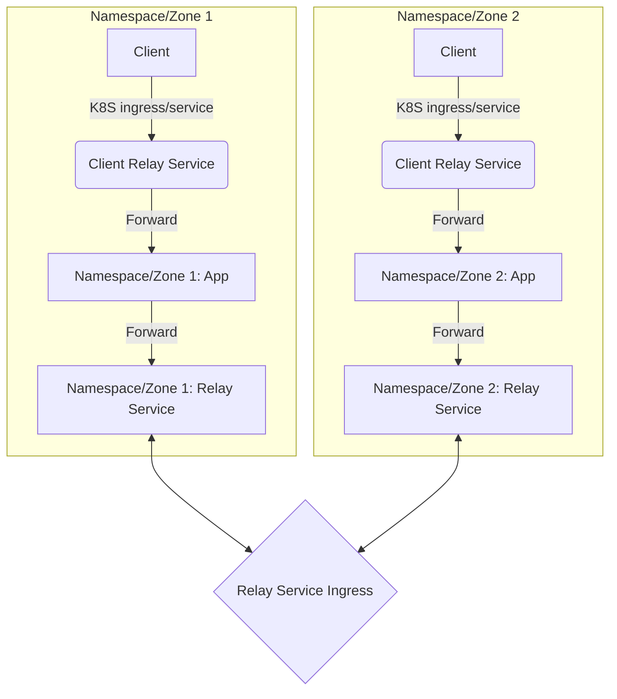
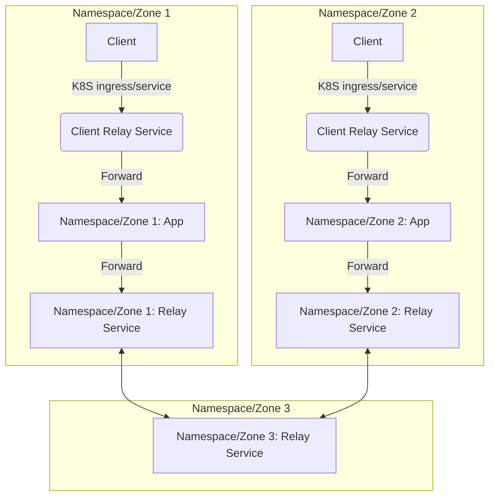
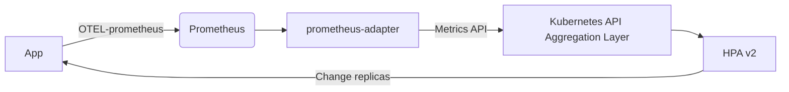

# Kubernetes 支持

对于有状态服务，扩容时涉及调整路由分布，缩容时涉及需要等待状态迁移完毕。

## 网络中继/流量代理

网络中继/流量代理需要搭配 [服务发现](../discovery.md) 模块使用。

+ 采用对Envoxy无侵入的方式
+ 协议层直接支持中继/代理服务转发
+ 节点可达性通过查找 [服务发现](../discovery.md) 里的连接进行，如果不可直连，则层层查询上游中继服务的可达性
  + 对于跨namespace/集群/逻辑区通信，我们可以配置集群内使用内部ip且限制namespace，Relay service加一组外部ip，不限制namespace。
  + 对于跨地域，高延迟网络，可以部署一组专用于跨地域转发的Relay service，使用按标签的连接匹配打通跨地域的Relay service和跨集群Relay service。

### 跨namespace/集群/逻辑区通信结构和服务发现设置示例



对于以上结构，服务端 [服务发现](../discovery.md) 的简要示例如下:

```yaml
app1:
  discovery:
    name: "Namespace/Zone 1: App"
    metadata:
      namespace_name: namespace_1
      kind: app
    gateway:
      - priority: 1
        address: ipv4://10.0.0.1:1234
        match:
          metadata:
            namespace_name: namespace_1
    advertise_relay:
      metadata:
        namespace_name: namespace_1
        kind: relay
relaysvr1:
  discovery:
    name: "Namespace/Zone 1: Relay Service"
    metadata:
      namespace_name: namespace_1
      kind: relay
    gateway:
      - priority: 1
        address: ipv4://10.0.1.1:1234
        match:
          metadata:
            namespace_name: namespace_1
      - priority: 2
        address: ipv4://172.16.0.1:1234
        match:
          metadata:
            kind: relay
app2:
  discovery:
    name: "Namespace/Zone 2: App"
    metadata:
      namespace_name: namespace_2
      kind: app
    gateway:
      - priority: 1
        address: ipv4://10.1.0.1:1234
        match:
          metadata:
            namespace_name: namespace_2
    advertise_relay:
      metadata:
        namespace_name: namespace_2
        kind: relay
relaysvr2:
  discovery:
    name: "Namespace/Zone 2: Relay Service"
    metadata:
      namespace_name: namespace_2
      kind: relay
    gateway:
      - priority: 1
        address: ipv4://10.1.1.1:1234
        match:
          metadata:
            namespace_name: namespace_2
      - priority: 2
        address: ipv4://172.17.0.1:1234
        match:
          metadata:
            kind: relay
```

### 跨地域（高延迟）通信结构和服务发现设置示例



对于以上结构，服务端 [服务发现](../discovery.md) 的简要示例如下:

```yaml
app1:
  discovery:
    name: "Namespace/Zone 1: App"
    metadata:
      namespace_name: namespace_1
      kind: app
      labels:
        "area.region": "CN"
    gateway:
      - priority: 1
        address: ipv4://10.0.0.1:1234
        match:
          metadata:
            namespace_name: namespace_1
    advertise_relay:
      metadata:
        namespace_name: namespace_1
        kind: relay
relaysvr1:
  discovery:
    name: "Namespace/Zone 1: Relay Service"
    metadata:
      namespace_name: namespace_1
      kind: relay
      labels:
        "area.region": "CN"
    gateway:
      - priority: 1
        address: ipv4://10.0.1.1:1234
        match:
          metadata:
            namespace_name: namespace_1
      - priority: 2
        address: ipv4://172.16.0.1:1234
        match:
          metadata:
            kind: relay
            labels:
              "area.region": "CN"
      - priority: 3
        address: ipv4://192.16.0.1:1234
        match:
          metadata:
            kind: relay
            labels:
              "area.region": "any"
    advertise_relay:
      metadata:
        kind: relay
        labels:
          "area.region": "any"
app2:
  discovery:
    name: "Namespace/Zone 2: App"
    metadata:
      namespace_name: namespace_2
      kind: app
      labels:
        "area.region": "US"
    gateway:
      - priority: 1
        address: ipv4://10.1.0.1:1234
        match:
          metadata:
            namespace_name: namespace_2
    advertise_relay:
      metadata:
        namespace_name: namespace_2
        kind: relay
relaysvr2:
  discovery:
    name: "Namespace/Zone 2: Relay Service"
    metadata:
      namespace_name: namespace_2
      kind: relay
      labels:
        "area.region": "US"
    gateway:
      - priority: 1
        address: ipv4://10.1.1.1:1234
        match:
          metadata:
            namespace_name: namespace_2
      - priority: 2
        address: ipv4://172.17.0.1:1234
        match:
          metadata:
            kind: relay
            labels:
              "area.region": "US"
      - priority: 3
        address: ipv4://192.17.0.1:1234
        match:
          metadata:
            kind: relay
            labels:
              "area.region": "any"
    advertise_relay:
      metadata:
        kind: relay
        labels:
          "area.region": "any"
relaysvr3:
  discovery:
    name: "Namespace/Zone 3: Relay Service"
    metadata:
      namespace_name: namespace_3
      kind: relay
      labels:
        "area.region": "any"
    gateway:
      - priority: 1
        address: ipv4://10.2.1.1:1234
        match:
          metadata:
            namespace_name: namespace_3
      - priority: 2
        address: ipv4://192.18.0.1:1234
        match:
          metadata:
            kind: relay
```

## HPA支持

### 方案一: 基于HPA v2和自定义Metric实现HPA

*需要K8S集群启用[apiserver 聚合层][7]，并部署需要的组件： <https://kubernetes.io/docs/tasks/run-application/horizontal-pod-autoscale/#support-for-metrics-apis>*

+ 使用StatefulSet来保证扩缩容的Pod启停顺序
  + 相关文档: <https://kubernetes.io/docs/concepts/workloads/controllers/statefulset/#deployment-and-scaling-guarantees>
+ 业务层需要自定义 [服务发现](../discovery.md) 和分布策略
  + 新节点上线时通过 [服务发现](../discovery.md) 机制调整分布
  + 发现需要缩容下线节点时，业务侧先进行转态转移，结束以后通过
+ 基于自定义Metrics控制HPA
  + 相关文档: <https://kubernetes.io/docs/tasks/run-application/horizontal-pod-autoscale-walkthrough/#autoscaling-on-more-specific-metrics>
    + 聚合值类型备注:
      + Value: 直接取值
      + AverageValue: Metric的值/Pod数量
  + 多个Metric时，k8s将分别计算每个metric，取max(计算出的副本数)
    + 指标一: 负载系数 -> 选用AverageValue类型 (扩容策略,也可以继续加一些按CPU/Memory的策略)
    + 指标二: max(有状态数据的Pod Index) -> 选用Value类型 (缩容策略)

K8s的Metrics可以采用实现部署 [kubernetes-sigs/custom-metrics-apiserver][1] 来提供访问接口，或者部署现成的 Resource Metrics API 的服务，比如: [metrics-server][2] 或 [prometheus-adapter][3] 。

> 详见文档:
>
> + <https://github.com/kubernetes/design-proposals-archive/blob/main/instrumentation/resource-metrics-api.md>
> + <https://github.com/kubernetes/metrics#apis>
> + <https://kubernetes.io/docs/tasks/debug/debug-cluster/resource-metrics-pipeline/#metrics-api>

由于 [metrics-server][2] 不建议作为CPU/Memory以外的指标提供服务，且 [prometheus][4] 是一个更加通用且成熟的方案，我们选用采用 [prometheus-adapter][3] 从外部 [prometheus][4] 服务导入Metric数据的方式。
对于 [prometheus][4] Pull模式的接入，我们可以采用 [opentelemetry-prometheus][5] 对[prometheus][4]的接入支持。（未来 [opentelemetry][6] 的）

> [opentelemetry][6] 第一个新兴的可观测性领域的CNCF基金会项目，包含Trace、Metrics、Logs三大模块。合并且替代了原有的opentracing和opencensus项目。
> 对于可观测性其他的功能支持，也可以使用 [opentelemetry][6] 规范，并提供接口给业务层使用，比如链路跟踪。

这样，在应用层只需要提供上报指标数据到 [prometheus][4] 即可。我们可以在 libatbus-rs 层导出一组接口，给应用层提供上报能力。



### 方案二: 基于CRD的HPA

对于老版本的K8S，如果不支持 HPA v2，可以考虑使用相似的替代CRD。比如: <https://github.com/TencentBlueKing/bk-bcs/blob/master/docs/features/bcs-general-pod-autoscaler/README.md>

借助 [bk-bcs][8] 模块，还能实现插入 PreDeleteHook ,以便在删除时二次确认状态数据确实已经转移完毕。针对这种场景，我们的 libatbus-rs 可以通过提供一个输出查询的HTTP server接口来实现。
详见: <https://github.com/TencentBlueKing/bk-bcs/blob/master/docs/features/bcs-gamedeployment-operator/features/preDeleteHook/pre-delete-hook.md>

如果K8S在 1.22 版本以上，我们可以通过 [pod-deletion-cost][9] 控制Pod的销毁权重。我们可以借助某些CRD通过某些方式（或提取Metric，或类似上面preDeleteHook的方式拉取数据）来动态设置 [pod-deletion-cost][9] ，然后通同样上面的方式自动HPA replicate的数量。这样可以做到精确且动态地剔除可以销毁地pod（而不仅仅是按pod index顺序）。

> 详见: <https://kubernetes.io/docs/concepts/workloads/controllers/replicaset/#pod-deletion-cost>

[1]: https://github.com/kubernetes-sigs/custom-metrics-apiserver
[2]: https://github.com/kubernetes-sigs/metrics-server
[3]: https://github.com/kubernetes-sigs/prometheus-adapter
[4]: https://prometheus.io/
[5]: https://crates.io/crates/opentelemetry-prometheus
[6]: https://opentelemetry.io/
[7]: https://kubernetes.io/docs/concepts/extend-kubernetes/api-extension/apiserver-aggregation/
[8]: https://github.com/TencentBlueKing/bk-bcs
[9]: https://kubernetes.io/docs/reference/labels-annotations-taints/#pod-deletion-cost
